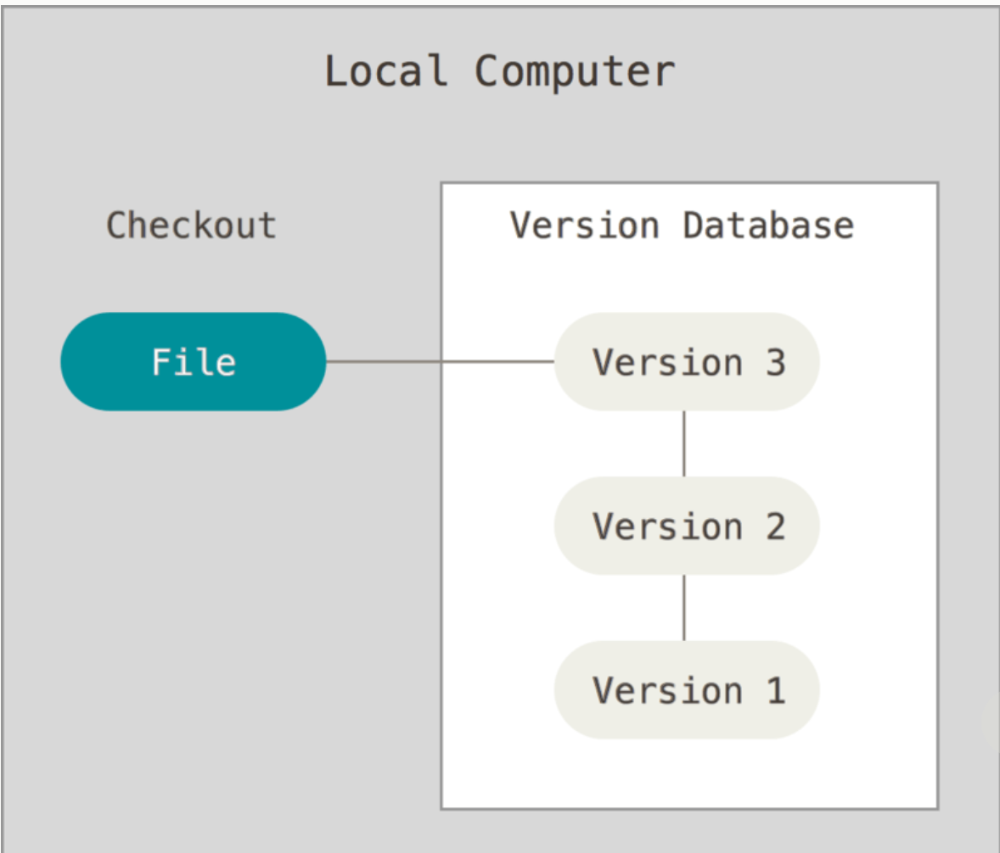
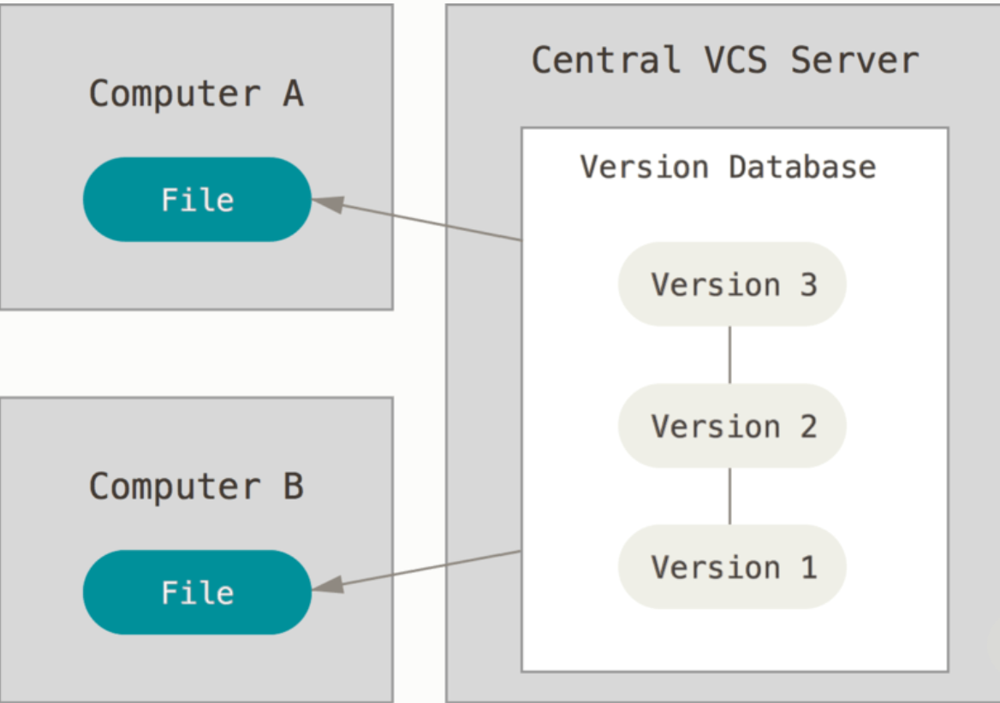
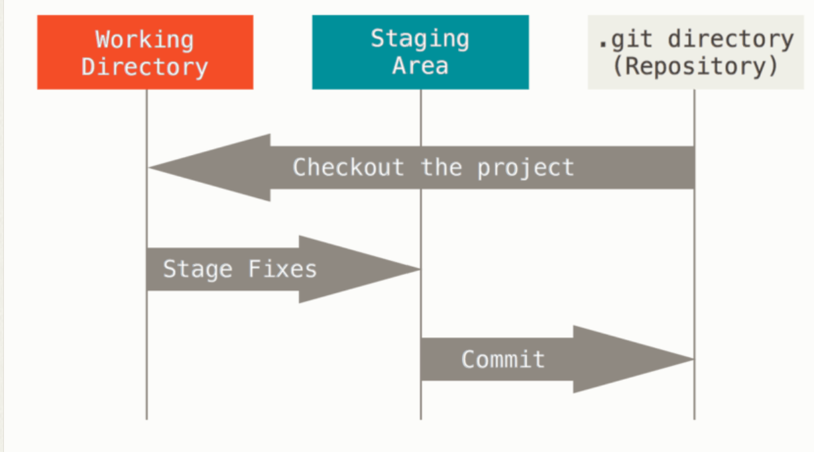

시작하기
==
## 버전 관리
파일의 변화를 시간에 따라 기록 했다가 나중에 특정 시점의 버전을 다시 꺼내올 수 있는 시스템 이런 시스템을 **버전 관리 시스템(Version Control System)**라 한다.

버전 관리를 위해 다음과 같은 방법을 사용한다.

#### 로컬 관리

- 디렉터리를 사용해서 버전 관리를 진행하는 방법을 사용하면 실수하기가 너무 쉽다.
- 간단한 데이터 베이스를 사용해 만든 로컬 VCS을 사용.

#### 중앙집중식 버전 관리

- 다른 개발자와 함께 작업을 수행하기 위해서 만든 버전 관리 시스템. 중앙에 별도에 서버를 운영하여 버전을 관리하는 시스템.
- 관리자가 중앙에서 관리할 수 있기 때문에 보다 꼼꼼하게 관리할 수 있다.
- 중앙 서버에 문제가 발생하면 아무런 작업을 수행할 수 없고 하던 일을 백업할 방법이 없다.

#### 분산 버전 관리 시스템
- Git, Mecurial, Bazaar, Darcs가 분산 버전 관리 시스템의 대표이다.
- 서버로부터 최종 상태만 가지고 오는 것이아니라 모든 변경 이력과 모든 파일 버전을 복제한다.
- 그래서 각 클라이언트는 전체 저장소의 완전한 백업을 갖게되 중앙 서버가 문제가 생기더라도 바로 백업을 수행할 수 있다.

## GIt 특징

#### 스냅샷
- 특정 커밋 시점에 저장소에 있는 모든 파일의 상태롤 기록한 것.
- Git은 이전 상태의 파일에 대한 링크를 저장하는 방식으로 프로젝트 상태를 저장(커밋)하는 순간을 저장한다.

#### 거의 모든 명령을 로컬에서 실행.
- CVCS과 달리 로컬에서 명령을 수행하여 히스토리를 조회할 수 있다.
- 필요 시점에 원격 저장소에 있는 내용을 가지고 오거나 변경사항을 반영할 수 있다.

#### 무결성
- 체크섬을 통해 데이터를 관리한다.
- 체크섬이 없으면 파일을 수정하거나 변경할 수 없다. 모든 파일을 해시로 관리한다.

#### 안전성
- 되돌리거나 데이터를 삭제할 방법이 없어 커밋 후 작업을 잃어버리는 것이 어렵다.

#### 세가지 상태
깃에서는 파일을 세 가지 상태로 관리한다.
- Staged
    - git add 명령을 통해 Modified 상태의 파일을 커밋할 것이라는 것을 알리는 상태. 
- Modified
    - 수정한 파일을 아직 로컬 데이터베이스에 커밋하지 않은 상태. 
- Commited
    - 로컬 데이터베이스에 안전하게 저장된 상태.

#### 세가지 단계
- Working Directory
    - 프로젝트의 특정 버전을 Checkout 한 것이다. 
    - Git Directory에서 워킹 디렉터리를 생성한다.
- Staging Area
    - 곧 커밋할 파일에 대한 정보를 저장한다.
- Git Directory
    - Git Clone을 할 때 생성되고 Git 메타데이터와 객체 데이터베이스를 저장하는 Git의 핵심 부분.

#### 작업 순서
- Working Directory에서 파일을 수정한다.
- Staging Area에 파일을 Stage해서 커밋할 스냅샷 생성.
- Staging Area에 있는 파일들을 커밋해서 Git 디렉터리에 영구적인 스냅샷 저장한다.

#### git config
git 설정에 사용되는 파일 목록
- /etc/gitconfig
    - 시스템의 모든 사용자와 모든 저장소에 적용되는 설정
    - git config --system 명령으로 읽거나 쓸 수 있다.
- /.gitconfig, ~/.config/git/config
    - 특정 사용자에게만 적용되는 설정
    - git config --global 옵션으로 이 파일을 읽거나 쓸 수 있다.
- .git/config
    - 현재 작업 디렉터리에만 적용된다.

#### 사용자 설정
- git config --global user.name
- git config --global user.email
을 설정한다.

